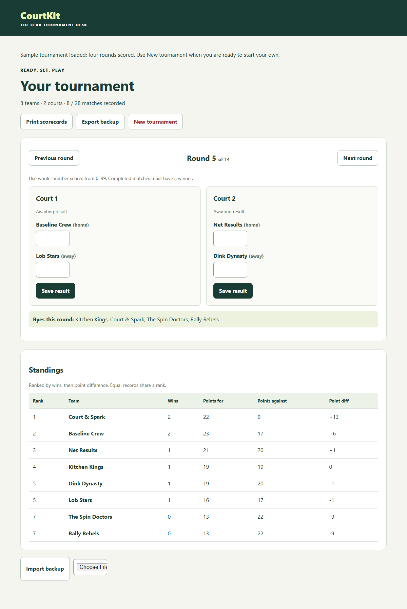

# CourtKit

**[Try the live demo](https://jevgenijostin.github.io/courtkit/)** — open it and select **Load sample tournament** to explore.

A small browser tournament desk for pickleball or padel clubs. Enter 4–12 fixed doubles teams and 1–4 courts to create a round robin where every team plays every other team once. Built with TypeScript, Vite, and plain CSS; no framework or backend.



## Run locally

Install a current Node.js LTS release and run:

```sh
npm ci
npm run dev
```

Open the local URL printed by Vite. For a production build, run `npm run build`; serve the resulting `dist` directory with a static web server (or use `npx vite preview` locally).

## Live demo

Open the [live demo](https://jevgenijostin.github.io/courtkit/) and select **Load sample tournament** on the setup screen. This loads eight club teams on two courts, with the first four rounds (eight matches) scored. Explore the standings, edit results, or select **Print scorecards** to preview all 28 matches and the current standings.

The sample is saved in this browser and survives refresh. Select **New tournament** and confirm to clear it before starting your own. The sample button is only available on the empty setup screen; if you already have a tournament, export a backup before clearing it, or try the demo in a separate browser profile.

## Status

CourtKit was built in one unattended overnight AI-assisted session on 2026-10-07 as a portfolio/demo project.

## Run a tournament

1. Enter one team name per line, choose the court count, and select **Create tournament**.
2. Record each match's home and away scores with **Save result**. Scores must be nonnegative whole numbers with a winner. Saved results can be edited.
3. Move through rounds with **Previous round** and **Next round**. All idle teams are listed as byes, including teams waiting because court capacity is limited.
4. Follow the standings, ranked by wins and then point difference. Teams tied on both share a rank.
5. Use **Print scorecards** (or the browser print command) to print blank scorecards for every scheduled match plus the current standings.

Teams, schedule, and saved scores persist automatically in this browser's localStorage. Refresh resumes at the first round with an unrecorded match. Unsaved input is not persisted. Keep the same browser and site address to access the saved tournament.

**Export backup** downloads a validated JSON file. **Import backup** restores one from either screen and asks before replacing an active tournament. **New tournament** asks before deleting the current saved tournament. Storage or import failures are shown on screen; a failed save does not replace the current state.

Production builds cache the app shell (HTML, CSS, and JavaScript) with a service worker on the first online visit. Once caching finishes, you can reload or reopen the same address offline and continue recording results. The first visit still needs a connection; clearing browser data also clears the offline cache and saved tournament, so export a backup first. Service workers require HTTPS (or localhost); caching is disabled in the Vite development server.

App-shell files use a cache-first strategy with a version derived from each build. Updates download on an online visit and activate after all existing app tabs close; reopen the app to use the update. No installation, push notifications, or background sync is required.

## Tests

```sh
npm run test
npx playwright install chromium
npm run test:e2e
```

Unit tests cover scheduling, standings, and storage validation. The Chromium end-to-end suite builds and serves the production app, creates a tournament, records and edits a result, checks standings and refresh persistence, verifies print visibility, and exercises backup export/import and reset confirmation. It also verifies the sample tournament, its standings and print view, and the transition back to a real tournament.

GitHub Actions runs dependency installation, unit tests, the production build, and Chromium end-to-end tests on pushes and pull requests to `main`, using Node 20 and npm caching.

The Pages workflow builds and deploys `dist/` on every push to `main` (or a manual workflow run), using the official GitHub Pages artifact and deployment actions with the built-in `GITHUB_TOKEN`. Its build sets `GITHUB_PAGES=true` to prefix assets with `/courtkit/`; ordinary local development and builds use `/`. To reproduce the Pages build locally, set that environment variable and run `npm ci` followed by `npm run build`.

`npm run build` checks TypeScript and produces the production bundle. Playwright starts its own preview server on port 4173; leave that port free.

The offline end-to-end check disables the ordinary HTTP cache, goes offline after the first load, reloads the app through the service worker, records a result, and reopens the tournament offline. Set `GITHUB_PAGES=true` when running `npm run test:e2e` to run the entire suite against `/courtkit/` as well.

To refresh the README screenshot, build and start `npm exec vite preview`, then run `node scripts/screenshot.mjs` (optionally passing the preview URL, including `/courtkit/` for a Pages build).
